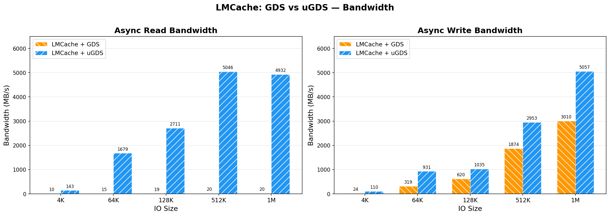
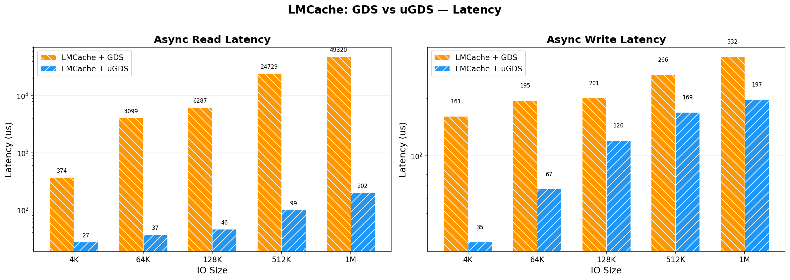
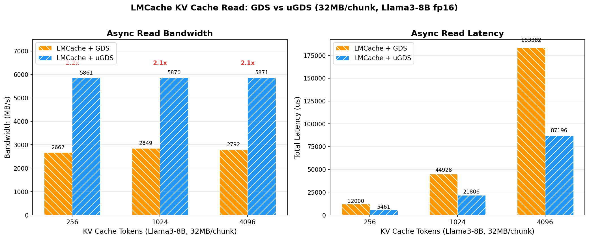
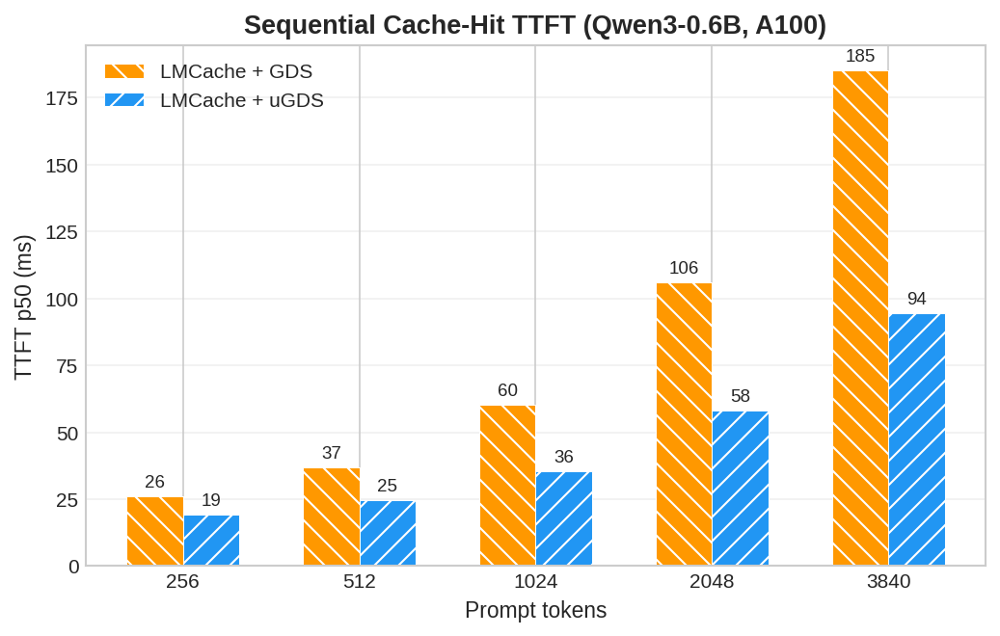
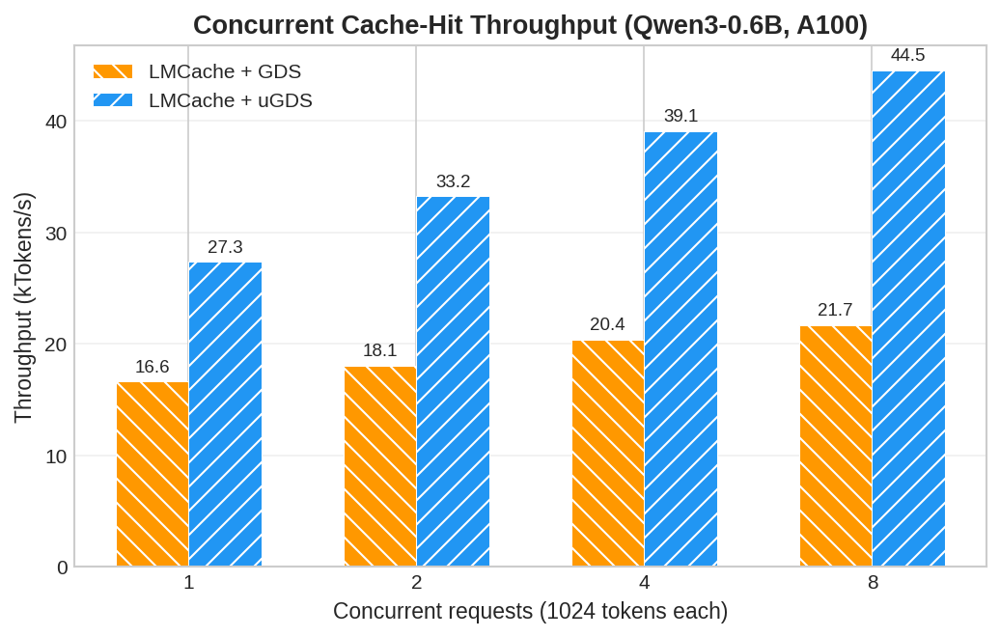
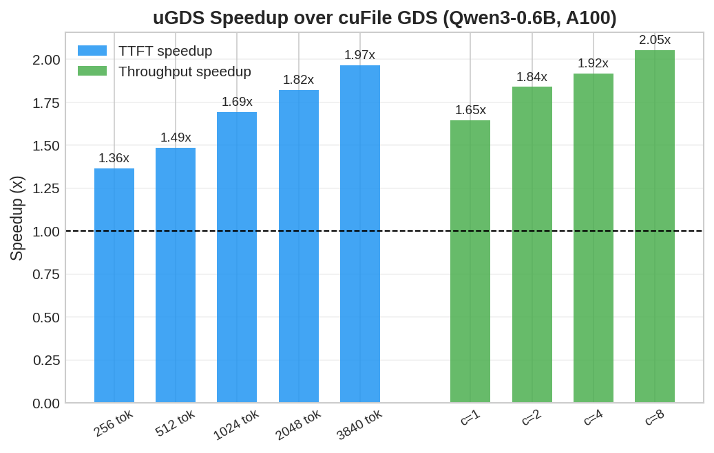

# LMCache uGDS Backend

This fork adds a [uGDS](https://github.com/ScaleX-IO/uGDS) storage backend
to the GDS L1 tier of [LMCache](https://github.com/LMCache/LMCache).

uGDS is a user-space GPUDirect Storage library: the NVMe IO path runs
entirely in user space (no kernel driver, no ioctl per IO), and the SSD
DMAs data directly to/from GPU memory. Compared to NVIDIA cuFile GDS,
uGDS delivers up to **2x lower TTFT** on cache-hit requests and **2x
higher throughput** under concurrent load in vLLM end-to-end benchmarks.

---

## Architecture

```
vLLM (scheduler / worker)
    │
    ├─ LMCacheMPConnector          (official vLLM KV connector)
    │      │
    │      └─ LMCache adapter      (ZMQ control + CUDA IPC)
    │              │
    ▼              ▼
vLLM paged KV   LMCache MP server
                       │  gather/scatter kernel
                       ▼
                 GPU staging buffer
                       │
                       ├─ cuFileAsync  → ext4 slab file   (GDS)
                       └─ uGDSAsync    → raw block device  (uGDS)
```

uGDS replaces the cuFile async IO path with a user-space NVMe stack.
Set `--gds-l1-backend ugds` and point `--gds-l1-path` at the raw device
(e.g. `/dev/ugds_drv0`). The rest of LMCache (chunking, hashing, slab
allocator, eviction) is unchanged.

## Performance

All benchmarks on NVIDIA A100-SXM4-40GB + Samsung 990 PRO (PCIe Gen4 x4).
Disk freshly formatted between backend switches. GPU and SSD on different
PCIe root complexes (cross-root-port P2P).

### LMCache IO-level (4K--1M, pipeline depth=1)





### LMCache KV cache read (32MB/chunk, Llama3-8B fp16)



Through the full `GDSContext` path (allocator + region registration +
async transfer), uGDS sustains ~5.9 GB/s vs ~2.7 GB/s for cuFile -- a
consistent **2.1x** speedup across pipeline depths 1--16.

### vLLM end-to-end (Qwen3-0.6B, A100)

Qwen3-0.6B, 256-token LMCache chunks, GDS L1 = 4 GiB, vLLM APC disabled,
`max_tokens=1` (pure TTFT measurement). Each prompt uses unique token IDs
to guarantee cold miss on first request; hot requests reuse the same prompt
to guarantee cache hit. Sequential: 5 hot repeats, report p50. Concurrent:
1024 tokens/request, 3 rounds, report median.







## Environment Setup

Requirements: NVIDIA GPU with CUDA, an NVMe SSD dedicated to uGDS, the
[uGDS](https://github.com/ScaleX-IO/uGDS) library built (`libugds.so`)
and its kernel module (`ugds_drv.ko`).

```bash
# Bind the NVMe SSD to the uGDS driver
cd /path/to/uGDS
scripts/env_switch.sh ugds 0000:b8:00.0
ls /dev/ugds_drv*

# Make libugds.so visible to the loader
export LD_LIBRARY_PATH=/path/to/uGDS/build:$LD_LIBRARY_PATH
```

To switch the SSD back to the kernel driver (for cuFile/GDS):

```bash
scripts/env_switch.sh gds 0000:b8:00.0
sudo mount -o data=ordered /dev/nvme0n1 /mnt/ugds_test
```

## Running the Benchmarks

### IO-level

```bash
# uGDS (SSD bound to ugds_drv)
python tests/v1/gpu_connector/bench_ugds_vs_gds.py --backend ugds
python tests/v1/gpu_connector/bench_chunk_read.py ugds
python tests/v1/gpu_connector/bench_chunk_read.py ugds-context

# cuFile GDS (SSD on kernel nvme driver, mounted)
python tests/v1/gpu_connector/bench_ugds_vs_gds.py --backend gds \
    --gds-file /mnt/ugds_test/bench_slab.bin
python tests/v1/gpu_connector/bench_chunk_read.py gds
python tests/v1/gpu_connector/bench_chunk_read.py gds-context
```

### vLLM end-to-end

The E2E benchmark starts an LMCache server and vLLM, runs sequential
cold/hot and concurrent cache-hit tests, and saves results to JSON.

```bash
# uGDS backend
export LD_LIBRARY_PATH=/path/to/uGDS/build
python dev-docs/bench_lmcache_e2e.py --backend ugds --device /dev/ugds_drv0

# cuFile GDS backend
python dev-docs/bench_lmcache_e2e.py --backend cufile --slab-dir /mnt/ugds_test
```

## Tests

```bash
# uGDS async backend unit + hardware roundtrip
pytest tests/v1/gpu_connector/test_ugds_async.py --noconftest -v
pytest tests/v1/gpu_connector/test_gds_context.py -v

# cuFile roundtrip (needs GDS-capable mount point)
LMCACHE_GDS_TEST_DIR=/mnt/ugds_test \
    pytest tests/v1/gpu_connector/test_gds_context.py -v
```

## License

Apache License 2.0. See [LICENSE](LICENSE).
