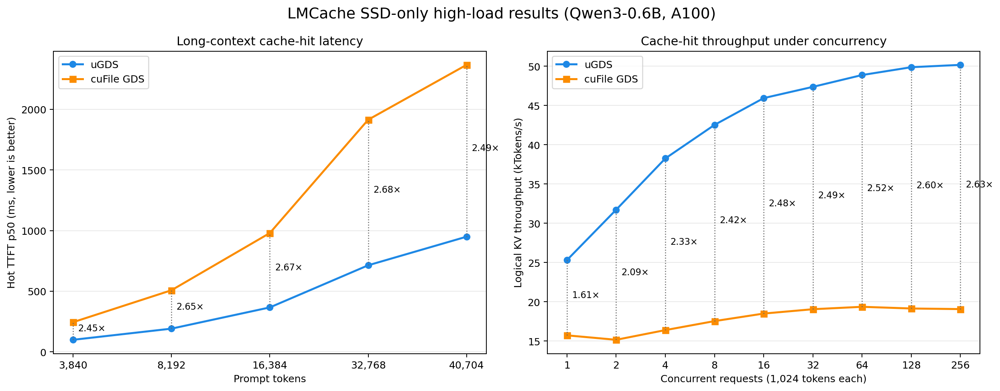
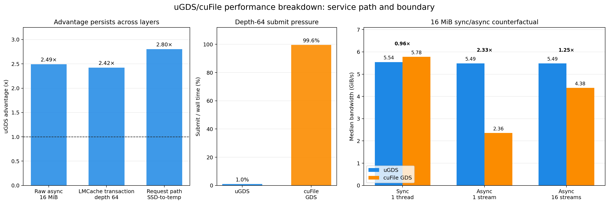
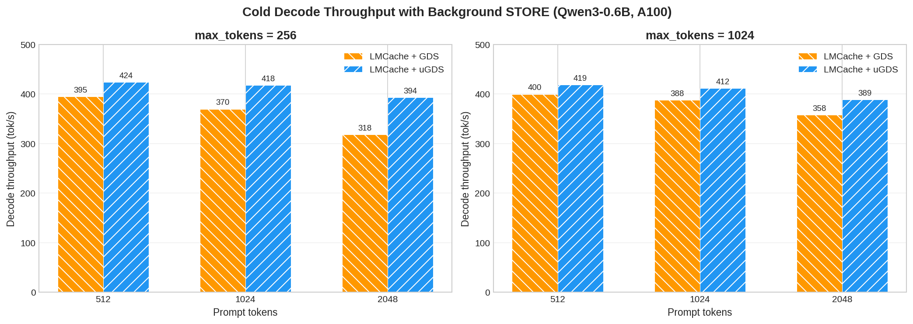

# LMCache uGDS Backend

This fork adds a [uGDS](https://github.com/ScaleX-IO/uGDS) storage backend
to the GDS L1 tier of [LMCache](https://github.com/LMCache/LMCache).

uGDS is a user-space GPUDirect Storage library: the NVMe IO path runs
entirely in user space (no kernel driver, no ioctl per IO), and the SSD
DMAs data directly to/from GPU memory. In the SSD-only high-load benchmark,
uGDS delivers up to **2.68× TTFT speedup** on cache-hit requests and **2.63×
the logical KV retrieval throughput** of NVIDIA cuFile GDS.

---

## Architecture

```
vLLM (scheduler / worker)
    │
    ├─ LMCacheMPConnector          (official vLLM KV connector)
    │      │
    │      └─ LMCache adapter      (ZMQ control + CUDA IPC)
    │              │
    ▼              ▼
vLLM paged KV   LMCache MP server
                       │  gather/scatter kernel
                       ▼
                 GPU staging buffer
                       │
                       ├─ cuFileAsync  → ext4 slab file   (GDS)
                       └─ uGDSAsync    → raw block device  (uGDS)
```

uGDS replaces the cuFile async IO path with a user-space NVMe stack.
Set `--gds-l1-backend ugds` and point `--gds-l1-path` at the raw device
(e.g. `/dev/ugds_drv0`). The rest of LMCache (chunking, hashing, slab
allocator, eviction) is unchanged.

## Performance

### Environment

| Component | Version |
|-----------|---------|
| GPU | NVIDIA A100-SXM4-40GB |
| SSD | Samsung 990 PRO (PCIe Gen4 x4, cross-root-port P2P) |
| Model | Qwen3-0.6B |
| vLLM | 0.20.1+cu129 |
| LMCache | 0.5.1.dev35 |
| PyTorch | 2.11.0+cu129 |
| CUDA | 12.9 |

LMCache chunk = 256 tokens, GDS L1 = 4 GiB, vLLM APC disabled.

### Cache-hit TTFT and throughput

`max_tokens=1` (pure TTFT measurement).

- **Sequential**: each prompt uses unique token IDs to guarantee a cold miss
  on first request. After the STORE completes, the same prompt is sent 5
  more times (cache hit); report TTFT p50.
- **Concurrent**: each concurrency level (1/2/4/8) uses separate 1024-token
  prompts, pre-warmed with a cold request. All requests then fire
  concurrently for 3 rounds; report median throughput.


### SSD-only high-load comparison

The high-load run uses a 40 GiB SSD L1, disables vLLM APC, and requires every
measured request to report a full external-cache hit. LMCache STORE and RETRIEVE
token totals are also checked before a point is accepted. Context pressure spans
3,840 to 40,704 prompt tokens; concurrency spans 1 to 256 requests with 1,024
tokens per request.



At 40,704 tokens, uGDS reduces hot TTFT p50 from 2,367.6 ms to 950.4 ms
(`2.49×`). At concurrency 256, uGDS reaches 50.2 kTokens/s versus 19.1
kTokens/s for cuFile GDS (`2.63×`). Throughput counts retrieved prompt/KV
tokens, not generated output tokens. See the
[high-load analysis](docs/design/v1/gpu_connector/ugds_gds_high_load_analysis.md)
for the workload contract, validity checks, raw-data locations, and scope.

### Performance breakdown

The matched breakdown follows the difference from raw 16 MiB async reads,
through the production-shaped LMCache transaction, to the request-level
SSD-to-temp stage. It then changes the API and stream count to test whether the
difference is a general storage-bandwidth limit or specific to LMCache's I/O
shape.



The async advantage is preserved across the raw, transaction, and request
layers (`2.42×–2.80×`). At depth 64, cuFile submission occupies 99.6% of the
transaction wall time, versus 1.0% for uGDS. The 16 MiB synchronous control is
statistically consistent with parity (`0.96×`, 90% CI `[0.939, 1.005]`), while
the matched single-stream async case separates by `2.33×`; 16 cuFile streams
recover much of the difference. The
[breakdown report](docs/design/v1/gpu_connector/ugds_gds_breakdown_findings.md)
defines the metrics, statistical treatment, causal interpretation, and
limitations.

### Cold decode throughput

Cold requests where the KV cache STORE (GPU → SSD write) runs concurrently
with decode. Prompt lengths 512/1024/2048, output lengths 256 and 1024
tokens, 3 repeats per config, report p50.



At 2048-token prompt with 256 output tokens, uGDS decode throughput is 24%
higher than cuFile GDS (394 vs 318 tok/s). The gap narrows with longer
generation (9% at 1024 output tokens).

## Usage

After environment setup (see below), the only difference from the default
cuFile GDS backend is two CLI flags and `LD_LIBRARY_PATH`:

```bash
# cuFile GDS (default)
lmcache server \
  --gds-l1-backend cufile \
  --gds-l1-path /mnt/nvme \
  ...

# uGDS
export LD_LIBRARY_PATH=/path/to/uGDS/build:$LD_LIBRARY_PATH
lmcache server \
  --gds-l1-backend ugds \
  --gds-l1-path /dev/ugds_drv0 \
  ...
```

All other server flags (`--chunk-size`, `--l1-size-gb`, `--eviction-policy`,
etc.) and the vLLM side (`--kv-transfer-config`) remain the same. No code
changes are needed in the application or vLLM launch command.

## Environment Setup

Requirements: NVIDIA GPU with CUDA, an NVMe SSD dedicated to uGDS, the
[uGDS](https://github.com/ScaleX-IO/uGDS) library built (`libugds.so`)
and its kernel module (`ugds_drv.ko`).

```bash
# Bind the NVMe SSD to the uGDS driver
cd /path/to/uGDS
scripts/env_switch.sh ugds 0000:b8:00.0
ls /dev/ugds_drv*

# Make libugds.so visible to the loader
export LD_LIBRARY_PATH=/path/to/uGDS/build:$LD_LIBRARY_PATH
```

To switch the SSD back to the kernel driver (for cuFile/GDS):

```bash
scripts/env_switch.sh gds 0000:b8:00.0
sudo mount -o data=ordered /dev/nvme0n1 /mnt/ugds_test
```

## Running the Benchmarks

### IO-level

```bash
# uGDS (SSD bound to ugds_drv)
python tests/v1/gpu_connector/bench_ugds_vs_gds.py --backend ugds
python tests/v1/gpu_connector/bench_chunk_read.py ugds
python tests/v1/gpu_connector/bench_chunk_read.py ugds-context

# cuFile GDS (SSD on kernel nvme driver, mounted)
python tests/v1/gpu_connector/bench_ugds_vs_gds.py --backend gds \
    --gds-file /mnt/ugds_test/bench_slab.bin
python tests/v1/gpu_connector/bench_chunk_read.py gds
python tests/v1/gpu_connector/bench_chunk_read.py gds-context
```

### vLLM end-to-end

The E2E benchmark starts a standalone LMCache server and vLLM with
``LMCacheMPConnector``. It runs sequential cold/hot and concurrent cache-hit
tests and saves results to JSON.

```bash
# uGDS backend
export LD_LIBRARY_PATH=/path/to/uGDS/build
python tests/v1/gpu_connector/bench_e2e.py \
    --backend ugds \
    --device /dev/ugds_drv0

# cuFile GDS backend
python tests/v1/gpu_connector/bench_e2e.py \
    --backend cufile \
    --slab-dir /mnt/ugds_test
```

For the SSD-only high-load experiment described above, run the same matrix for
each backend. The output paths are explicit so the comparison can be reproduced
without relying on a user-specific directory:

```bash
# Run once with the SSD bound to uGDS.
python tests/v1/gpu_connector/bench_e2e.py \
    --backend ugds --device /dev/ugds_drv0 \
    --model /path/to/Qwen3-0.6B --ssd-only \
    --l1-size-gb 40 --max-model-len 40960 --max-num-seqs 256 \
    --seq-token-counts 3840,8192,16384,32768,40704 \
    --seq-hot-repeats 5 --conc-token-count 1024 \
    --conc-levels 1,2,4,8,16,32,64,128,256 --conc-rounds 3 \
    --output results/high_load/ugds.json

# Rebind and mount the SSD for cuFile, then run the matched workload.
python tests/v1/gpu_connector/bench_e2e.py \
    --backend cufile --slab-dir /mnt/ugds_test \
    --model /path/to/Qwen3-0.6B --ssd-only \
    --l1-size-gb 40 --max-model-len 40960 --max-num-seqs 256 \
    --seq-token-counts 3840,8192,16384,32768,40704 \
    --seq-hot-repeats 5 --conc-token-count 1024 \
    --conc-levels 1,2,4,8,16,32,64,128,256 --conc-rounds 3 \
    --output results/high_load/gds.json

python tests/v1/gpu_connector/plot_e2e_high_load.py \
    results/high_load/ugds.json results/high_load/gds.json \
    --output assets/lmcache_e2e_high_load.png
```

### Performance breakdown

The breakdown uses the same 40 GiB workset and five measured rounds reported in
the analysis. Select one backend after binding the SSD appropriately. For uGDS,
set both paths to the raw device:

```bash
export BACKEND=ugds
export RAW_PATH=/dev/ugds_drv0
export CONTEXT_PATH=/dev/ugds_drv0
export OUTPUT_ROOT=results/breakdown/runs/ugds
```

For cuFile, use a file for the raw benchmark and the containing directory for
the production `GDSContext` benchmark:

```bash
export BACKEND=cufile
export RAW_PATH=/mnt/ugds_test/breakdown_raw.bin
export CONTEXT_PATH=/mnt/ugds_test
export OUTPUT_ROOT=results/breakdown/runs/cufile
```

Then run the matched raw and production-transaction campaigns. The first raw
round initializes and validates the 40 GiB workset; later rounds reuse it.

```bash
python -m tests.v1.gpu_connector.bench_breakdown_raw_async \
    --backend "$BACKEND" --path "$RAW_PATH" --round 1 --initialize \
    --output-dir "$OUTPUT_ROOT/raw_async"

for round in 2 3 4 5; do
    python -m tests.v1.gpu_connector.bench_breakdown_raw_async \
        --backend "$BACKEND" --path "$RAW_PATH" --round "$round" \
        --output-dir "$OUTPUT_ROOT/raw_async"
done

for round in 1 2 3 4 5; do
    python -m tests.v1.gpu_connector.bench_breakdown_transaction \
        --backend "$BACKEND" --mode raw --path "$RAW_PATH" --round "$round" \
        --output-dir "$OUTPUT_ROOT/production_transaction"
    python -m tests.v1.gpu_connector.bench_breakdown_transaction \
        --backend "$BACKEND" --mode context --path "$CONTEXT_PATH" \
        --round "$round" \
        --output-dir "$OUTPUT_ROOT/production_transaction"
done
```

Build the matched sync/async benchmark from the checked-in CUDA source. Set
`UGDS_ROOT`, `CUDA_HOME`, and `CUFILE_LIB_DIR` to the corresponding installation
directories on the test host:

```bash
mkdir -p /tmp/lmcache-breakdown

nvcc -O3 -std=c++17 \
    -I"$UGDS_ROOT/include" \
    tests/v1/gpu_connector/bench_breakdown_sync_async.cu \
    -L"$UGDS_ROOT/build" -lugds -lpthread \
    -o /tmp/lmcache-breakdown/bench_ugds

nvcc -O3 -std=c++17 -DUSE_NVIDIA_GDS \
    -I"$CUDA_HOME/include" \
    tests/v1/gpu_connector/bench_breakdown_sync_async.cu \
    -L"$CUFILE_LIB_DIR" -lcufile -lpthread \
    -o /tmp/lmcache-breakdown/bench_cufile
```

Run each matrix after switching the SSD to the corresponding backend. The
cuFile target must be an allocated file of at least 2 GiB.

```bash
# uGDS matrix
BREAKDOWN_UGDS_LIB_DIR="$UGDS_ROOT/build" \
BREAKDOWN_CUDA_LIB_DIR="$CUDA_HOME/lib64" \
tests/v1/gpu_connector/run_breakdown_sync_async_matrix.sh \
    ugds /dev/ugds_drv0 /tmp/lmcache-breakdown/bench_ugds \
    results/breakdown/runs/sync_async_matrix/ugds

# cuFile matrix, after rebinding and mounting the SSD
fallocate -l 2G /mnt/ugds_test/breakdown_matrix.bin
BREAKDOWN_CUFILE_LIB_DIR="$CUFILE_LIB_DIR" \
BREAKDOWN_CUDA_LIB_DIR="$CUDA_HOME/lib64" \
tests/v1/gpu_connector/run_breakdown_sync_async_matrix.sh \
    cufile /mnt/ugds_test/breakdown_matrix.bin \
    /tmp/lmcache-breakdown/bench_cufile \
    results/breakdown/runs/sync_async_matrix/cufile
```

## Tests

```bash
# uGDS async backend unit + hardware roundtrip
pytest tests/v1/gpu_connector/test_ugds_async.py --noconftest -v
pytest tests/v1/gpu_connector/test_gds_context.py -v

# cuFile roundtrip (needs GDS-capable mount point)
LMCACHE_GDS_TEST_DIR=/mnt/ugds_test \
    pytest tests/v1/gpu_connector/test_gds_context.py -v
```

## License

Apache License 2.0. See [LICENSE](LICENSE).
