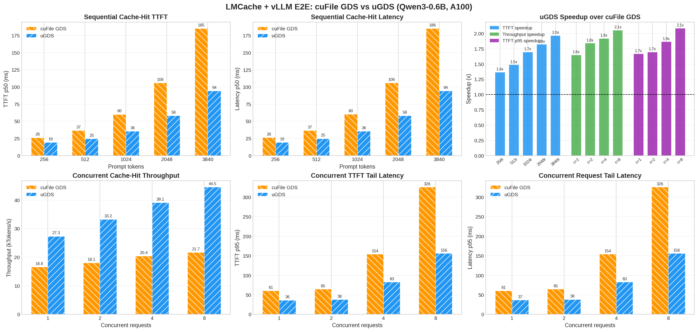

# LMCache uGDS Backend

This fork adds a **uGDS** backend to the GDS L1 tier of
[LMCache](https://github.com/LMCache/LMCache). uGDS is a user-space
GPUDirect Storage library: the NVMe IO path runs entirely in user space
(no kernel NVMe driver, no ioctl per IO), and the SSD DMAs data directly
to/from GPU memory. Set `backend: "ugds"` in the GDS L1 config and point
`file_location` at the raw device (e.g. `/dev/ugds_drv0`).

## Environment setup

Requirements: NVIDIA GPU with CUDA, an NVMe SSD dedicated to uGDS, the
[uGDS](https://github.com/ScaleX-IO/uGDS) library built (`libugds.so`) and
its kernel module (`ugds_drv.ko`).

```bash
# Bind the NVMe SSD to the uGDS driver (replace the PCI address with yours)
cd /path/to/uGDS
scripts/env_switch.sh ugds 0000:b8:00.0
ls /dev/ugds_drv*          # device node index depends on bind order

# Make libugds.so visible to the loader
export LD_LIBRARY_PATH=/path/to/uGDS/build:$LD_LIBRARY_PATH
```

To switch the SSD back to the kernel driver (for cuFile/GDS or regular
file IO):

```bash
scripts/env_switch.sh gds 0000:b8:00.0
sudo mount -o data=ordered /dev/nvme0n1 /mnt/ugds_test
```

## Running the tests

```bash
# uGDS backend unit + hardware roundtrip tests (skipped without hardware)
pytest tests/v1/gpu_connector/test_ugds_async.py --noconftest -v
pytest tests/v1/gpu_connector/test_gds_context.py -v

# cuFile roundtrip tests need a GDS-capable filesystem named explicitly
# (tmp_path may live on LVM, which nvidia-fs cannot register)
LMCACHE_GDS_TEST_DIR=/mnt/ugds_test pytest tests/v1/gpu_connector/test_gds_context.py -v
```

## Benchmarks

`tests/v1/gpu_connector/bench_ugds_vs_gds.py` sweeps IO size (4K to 1M) and
pipeline depth (1 to 64) through the async backend interface:

```bash
# Phase 1: uGDS (SSD bound to ugds_drv)
python tests/v1/gpu_connector/bench_ugds_vs_gds.py --backend ugds

# Phase 2: GDS/cuFile (switch the driver and mount first, see above)
python tests/v1/gpu_connector/bench_ugds_vs_gds.py --backend gds \
    --gds-file /mnt/ugds_test/bench_slab.bin
```

Results are saved to `bench_results_{backend}.json`.

`tests/v1/gpu_connector/bench_chunk_read.py` measures reads at the realistic
32 MB chunk size, either at the raw backend level or through the full
LMCache `GDSContext` path:

```bash
python tests/v1/gpu_connector/bench_chunk_read.py ugds          # raw uGDS
python tests/v1/gpu_connector/bench_chunk_read.py ugds-context  # via GDSContext
python tests/v1/gpu_connector/bench_chunk_read.py gds           # raw cuFile async
python tests/v1/gpu_connector/bench_chunk_read.py gds-sync      # cuFile sync
python tests/v1/gpu_connector/bench_chunk_read.py gds-context   # via GDSContext
```

Iteration count and pipeline depths are tunable via `LMCACHE_BENCH_ITERS`,
`LMCACHE_BENCH_WARMUP`, and `LMCACHE_BENCH_DEPTHS`.

## Performance

All benchmarks below were collected on NVIDIA A100-SXM4-40GB + Samsung 990 PRO
(PCIe Gen4 x4), with the disk freshly formatted between backend switches. GPU
and SSD are on different PCIe root complexes (cross-root-port P2P).

### IO-level: Async Read/Write (4K--1M, depth=1)


uGDS read latency is 14x lower at 4K and stays under 203 us at 1M (vs 49 ms
for cuFile). Read bandwidth reaches 5 GB/s at 512K; write bandwidth reaches
5 GB/s at 1M.

### KV cache read: 32MB chunks (Llama3-8B fp16, 256 tokens/chunk)


Through the full `GDSContext` path (allocator + region registration + async
transfer), uGDS sustains ~5.9 GB/s vs ~2.7 GB/s for cuFile -- a consistent
2.1x speedup across pipeline depths 1--16.

### vLLM end-to-end: cache-hit TTFT and throughput

Model: Qwen3-0.6B, 256-token LMCache chunks, GDS L1 = 4 GiB, APC disabled,
`max_tokens=1` (pure TTFT measurement).



**Sequential cache-hit (unique prompts, 5 hot repeats, p50):**

| Tokens | cuFile TTFT p50 (ms) | uGDS TTFT p50 (ms) | Speedup |
|-------:|---------------------:|--------------------:|--------:|
| 256 | 26.2 | 19.2 | 1.4x |
| 512 | 36.7 | 24.7 | 1.5x |
| 1024 | 60.2 | 35.5 | 1.7x |
| 2048 | 105.9 | 58.2 | 1.8x |
| 3840 | 185.3 | 94.3 | 2.0x |

**Concurrent cache-hit (1024 tokens/request, 3 rounds, median):**

| Concurrency | cuFile throughput (kTok/s) | uGDS throughput (kTok/s) | cuFile TTFT p95 (ms) | uGDS TTFT p95 (ms) |
|------------:|--------------------------:|-------------------------:|---------------------:|-------------------:|
| 1 | 16.6 | 27.3 | 60.8 | 36.5 |
| 2 | 18.1 | 33.2 | 64.8 | 38.2 |
| 4 | 20.4 | 39.1 | 154.2 | 82.8 |
| 8 | 21.7 | 44.5 | 325.8 | 156.3 |

At concurrency 8, uGDS delivers 2.1x throughput and 52% lower TTFT p95.
